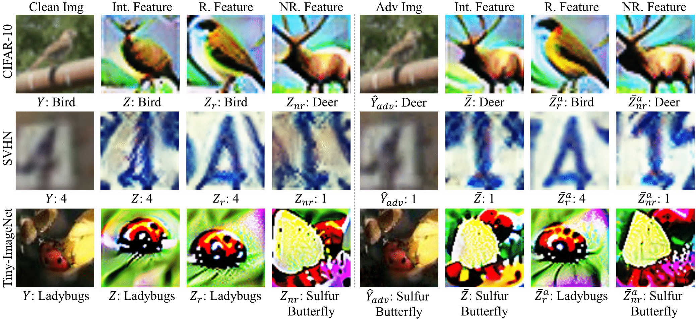

# NeurIPS 2021

## Title: Distilling Robust and Non-Robust Features in Adversarial Examples by Information Bottleneck [(paper)](https://openreview.net/forum?id=90M-91IZ0JC)

---

#### Authors: [Junho Kim*](https://scholar.google.com/citations?user=ZxE16ZUAAAAJ&hl=en), [Byung-Kwan Lee*](https://scholar.google.co.kr/citations?user=rl0JXCQAAAAJ&hl=en), and [Yong Man Ro](https://scholar.google.co.kr/citations?user=IPzfF7cAAAAJ&hl=en) (*: equally contributed)
#### Affiliation: School of Electric Engineering, Korea Advanced Institute of Science and Technology (KAIST)
#### Email: `arkimjh@kaist.ac.kr`, `leebk@kaist.ac.kr`, `ymro@kaist.ac.kr`

---
This is official code for the paper of "Distilling Robust and Non-Robust Features in Adversarial Examples by Information Bottleneck" published in NeurIPS 21. 
It provides novel method of decomposing robust and non-robust features in intermediate layer.
Further, we understand the semantic information of distilled features, by directly visualizing robust and non-robust features in the feature representation space.
Consequently, we reveal that both of the robust and non-robust features indeed have semantic information in terms of human-perception by themselves. For more detail, you can refer to our paper!


---


## Citation
If you find this work helpful, please cite it as:

```
@inproceedings{
kim2021distilling,
title={Distilling Robust and Non-Robust Features in Adversarial Examples by Information Bottleneck},
author={Junho Kim and Byung-Kwan Lee and Yong Man Ro},
booktitle={Advances in Neural Information Processing Systems},
editor={A. Beygelzimer and Y. Dauphin and P. Liang and J. Wortman Vaughan},
year={2021},
url={https://openreview.net/forum?id=90M-91IZ0JC}
}
```
---

## Datasets
* [CIFAR-10](https://www.cs.toronto.edu/~kriz/cifar.html)
* [SVHN](http://ufldl.stanford.edu/housenumbers/)
* [Tiny-ImageNet](https://www.kaggle.com/c/tiny-imagenet/overview)

---

## Baseline Models

* [VGG-16](https://arxiv.org/abs/1409.1556) *(model/vgg.py)*
* [WideResNet-28-10](https://arxiv.org/abs/1605.07146) *(model/wideresnet.py)*

---

## Adversarial Attacks (by [torchattacks](https://github.com/Harry24k/adversarial-attacks-pytorch))
* Fast Gradient Sign Method ([FGSM](https://arxiv.org/abs/1412.6572))
* Basic Iterative Method ([BIM](https://arxiv.org/abs/1611.01236))
* Projected Gradient Descent ([PGD](https://arxiv.org/abs/1706.06083))
* Carlini & Wagner ([CW](https://arxiv.org/abs/1608.04644))
* AutoAttack ([AA](https://arxiv.org/abs/2003.01690))
* Fast Adaptive Boundary ([FAB](http://proceedings.mlr.press/v119/croce20a.html))

This implementation details are described in *loader/loader.py*.
``` bash
    # Gradient Clamping based Attack
    if args.attack == "fgsm":
        return torchattacks.FGSM(model=net, eps=args.eps)

    elif args.attack == "bim":
        return torchattacks.BIM(model=net, eps=args.eps, alpha=1/255)

    elif args.attack == "pgd":
        return torchattacks.PGD(model=net, eps=args.eps,
                                alpha=args.eps/args.steps*2.3, steps=args.steps, random_start=True)

    elif args.attack == "cw":
        return torchattacks.CW(model=net, c=0.1, lr=0.1, steps=200)

    elif args.attack == "auto":
        return torchattacks.APGD(model=net, eps=args.eps)

    elif args.attack == "fab":
        return torchattacks.FAB(model=net, eps=args.eps, n_classes=args.n_classes)
```

---
## Included Packages (for Ours)
* Informative Feature Package *(model/IFP.py)*
  * Distilling robust and non-robust features in intermediate layer by Information Bottleneck
* Visualization of robust and non-robust features *(visualization/inversion.py)*
* Non-Robust Feature (NRF) and Robust Feature (RF) Attack *(model/IFP.py)*
  * **NRF** : maximizing the magnitude of non-robust feature gradients
  * **NRF2** : minimizing the magnitude of non-robust feature gradients
  * **RF** : maximizing the magnitude of robust feature gradients
  * **RF2** : minimizing the magnitude of robust feature gradients

---

## Baseline Methods
* **Plain**  *(Plain Training)*
    - Run `train_plain.py`
  
    ```python
      parser.add_argument('--lr', default=0.01, type=float, help='learning rate')
      parser.add_argument('--dataset', default='cifar10', type=str, help='dataset name')
      parser.add_argument('--network', default='vgg', type=str, help='network name')
      parser.add_argument('--gpu_id', default='0', type=str, help='gpu id')
      parser.add_argument('--data_root', default='./datasets', type=str, help='path to dataset')
      parser.add_argument('--epoch', default=60, type=int, help='epoch number')
      parser.add_argument('--batch_size', default=100, type=int, help='Batch size')
      parser.add_argument('--pretrained', default='false', type=str2bool, help='pretrained boolean')
      parser.add_argument('--batchnorm', default='true', type=str2bool, help='batchnorm boolean')
      parser.add_argument('--save_dir', default='./experiment', type=str, help='save directory')
    ```
  
* **AT**     *([PGD Adversarial Training](https://openreview.net/forum?id=rJzIBfZAb))*
    - Run `train_AT.py`

    ```bash
      parser.add_argument('--lr', default=0.01, type=float, help='learning rate')
      parser.add_argument('--steps', default=10, type=int, help='adv. steps')
      parser.add_argument('--eps', default=0.03, type=float, help='max norm')
      parser.add_argument('--dataset', default='cifar10', type=str, help='dataset name')
      parser.add_argument('--network', default='vgg', type=str, help='network name')
      parser.add_argument('--gpu_id', default='0', type=str, help='gpu id')
      parser.add_argument('--data_root', default='./datasets', type=str, help='path to dataset')
      parser.add_argument('--epoch', default=60, type=int, help='epoch number')
      parser.add_argument('--batch_size', default=100, type=int, help='Batch size')
      parser.add_argument('--attack', default='pgd', type=str, help='attack type')
      parser.add_argument('--pretrained', default='false', type=str2bool, help='pretrained boolean')
      parser.add_argument('--batchnorm', default='true', type=str2bool, help='batchnorm boolean')
      parser.add_argument('--save_dir', default='./experiment', type=str, help='save directory')
    ```

  
* **TRADES**  *([Recent defense method](http://proceedings.mlr.press/v97/zhang19p.html))*
    - Run `train_TRADES.py`
  
    ```python
      parser.add_argument('--lr', default=0.01, type=float, help='learning rate')
      parser.add_argument('--steps', default=10, type=int, help='adv. steps')
      parser.add_argument('--eps', default=0.03, type=float, help='max norm')
      parser.add_argument('--dataset', default='cifar10', type=str, help='dataset name')
      parser.add_argument('--network', default='wide', type=str, help='network name: vgg or wide')
      parser.add_argument('--gpu_id', default='0', type=str, help='gpu id')
      parser.add_argument('--data_root', default='./datasets', type=str, help='path to dataset')
      parser.add_argument('--epoch', default=60, type=int, help='epoch number')
      parser.add_argument('--batch_size', default=100, type=int, help='Batch size')
      parser.add_argument('--attack', default='pgd', type=str, help='attack type')
      parser.add_argument('--pretrained', default='false', type=str2bool, help='pretrained boolean')
      parser.add_argument('--batchnorm', default='true', type=str2bool, help='batchnorm boolean')
      parser.add_argument('--save_dir', default='./experiment', type=str, help='save directory')
    ```


* **MART**  *([Recent defense method](https://openreview.net/forum?id=rklOg6EFwS))*
    - Run `train_MART.py`
  
    ```python
      parser.add_argument('--lr', default=0.01, type=float, help='learning rate')
      parser.add_argument('--steps', default=10, type=int, help='adv. steps')
      parser.add_argument('--eps', default=0.03, type=float, help='max norm')
      parser.add_argument('--dataset', default='cifar10', type=str, help='dataset name')
      parser.add_argument('--network', default='wide', type=str, help='network name')
      parser.add_argument('--gpu_id', default='0', type=str, help='gpu id')
      parser.add_argument('--data_root', default='./datasets', type=str, help='path to dataset')
      parser.add_argument('--epoch', default=60, type=int, help='epoch number')
      parser.add_argument('--batch_size', default=100, type=int, help='Batch size')
      parser.add_argument('--attack', default='pgd', type=str, help='attack type')
      parser.add_argument('--pretrained', default='false', type=str2bool, help='pretrained boolean')
      parser.add_argument('--batchnorm', default='true', type=str2bool, help='batchnorm boolean')
      parser.add_argument('--save_dir', default='./experiment', type=str, help='save directory')
    ```

---

### Testing Model Robustness

* **Mearsuring the robustness in baseline models trained with baseline methods**
  - Run `test.py` 

    ```python
    parser.add_argument('--steps', default=10, type=int, help='adv. steps')
    parser.add_argument('--eps', default=0.03, type=float, help='max norm')
    parser.add_argument('--dataset', default='cifar10', type=str, help='dataset name')
    parser.add_argument('--network', default='vgg', type=str, help='network name')
    parser.add_argument('--data_root', default='./datasets', type=str, help='path to dataset')
    parser.add_argument('--gpu_id', default='0', type=str, help='gpu id')
    parser.add_argument('--save_dir', default='./experiment', type=str, help='save directory')
    parser.add_argument('--batch_size', default=100, type=int, help='Batch size')
    parser.add_argument('--pop_number', default=3, type=int, help='Batch size')
    parser.add_argument('--datetime', default='00000000', type=str, help='checkpoint datetime')
    parser.add_argument('--pretrained', default='false', type=str2bool, help='pretrained boolean')
    parser.add_argument('--batchnorm', default='true', type=str2bool, help='batchnorm boolean')
    parser.add_argument('--baseline', default='AT', type=str, help='baseline')
    ```


---
### Visualizing Robust and Non-Robust Features
* **Feature Interpreation**
    - Run `visualize.py`
  
    ```python
    parser.add_argument('--lr', default=0.01, type=float, help='learning rate')
    parser.add_argument('--steps', default=10, type=int, help='adv. steps')
    parser.add_argument('--eps', default=0.03, type=float, help='max norm')
    parser.add_argument('--dataset', default='cifar10', type=str, help='dataset name')
    parser.add_argument('--network', default='vgg', type=str, help='network name')
    parser.add_argument('--gpu_id', default='0', type=str, help='gpu id')
    parser.add_argument('--data_root', default='./datasets', type=str, help='path to dataset')
    parser.add_argument('--epoch', default=0, type=int, help='epoch number')
    parser.add_argument('--attack', default='pgd', type=str, help='attack type')
    parser.add_argument('--save_dir', default='./experiment', type=str, help='save directory')
    parser.add_argument('--batch_size', default=1, type=int, help='Batch size')
    parser.add_argument('--pop_number', default=3, type=int, help='Batch size')
    parser.add_argument('--prior', default='AT', type=str, help='Plain or AT')
    parser.add_argument('--prior_datetime', default='00000000', type=str, help='checkpoint datetime')
    parser.add_argument('--pretrained', default='false', type=str2bool, help='pretrained boolean')
    parser.add_argument('--batchnorm', default='true', type=str2bool, help='batchnorm boolean')
    parser.add_argument('--vis_atk', default='True', type=str2bool, help='is attacked image?')
    ```
---
